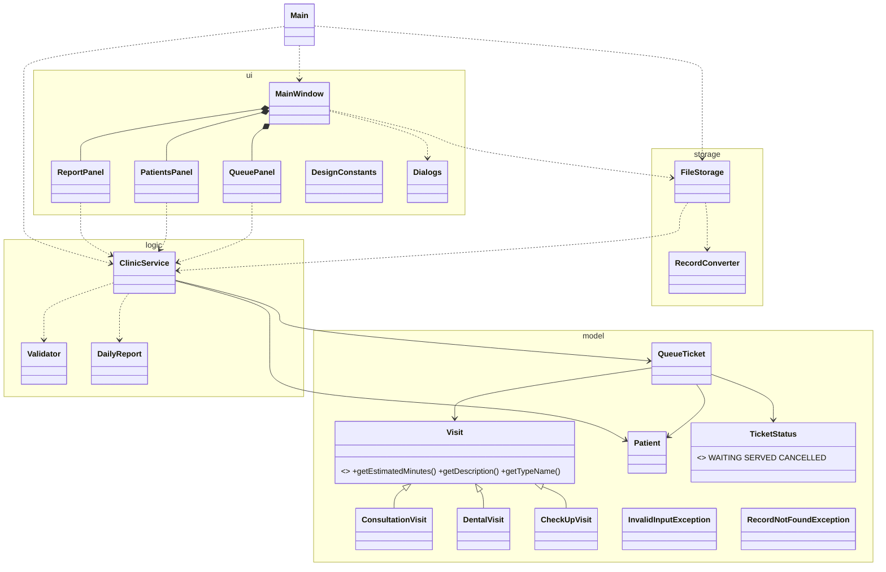

# Class Diagram

```mermaid
classDiagram
    class Main
    namespace model {
        class Visit { <<abstract>> +getEstimatedMinutes() +getDescription() +getTypeName() }
        class ConsultationVisit
        class DentalVisit
        class CheckUpVisit
        class Patient
        class QueueTicket
        class TicketStatus { <<enumeration>> WAITING SERVED CANCELLED }
        class InvalidInputException
        class RecordNotFoundException
    }
    namespace logic {
        class ClinicService
        class Validator
        class DailyReport
    }
    namespace storage {
        class FileStorage
        class RecordConverter
    }
    namespace ui {
        class MainWindow
        class QueuePanel
        class PatientsPanel
        class ReportPanel
        class DesignConstants
        class Dialogs
    }
    Visit <|-- ConsultationVisit
    Visit <|-- DentalVisit
    Visit <|-- CheckUpVisit
    QueueTicket --> Patient
    QueueTicket --> Visit
    QueueTicket --> TicketStatus
    ClinicService --> Patient
    ClinicService --> QueueTicket
    ClinicService ..> Validator
    ClinicService ..> DailyReport
    FileStorage ..> ClinicService
    FileStorage ..> RecordConverter
    MainWindow *-- QueuePanel
    MainWindow *-- PatientsPanel
    MainWindow *-- ReportPanel
    QueuePanel ..> ClinicService
    PatientsPanel ..> ClinicService
    ReportPanel ..> ClinicService
    MainWindow ..> FileStorage
    MainWindow ..> Dialogs
    Main ..> MainWindow
    Main ..> FileStorage
    Main ..> ClinicService
```
